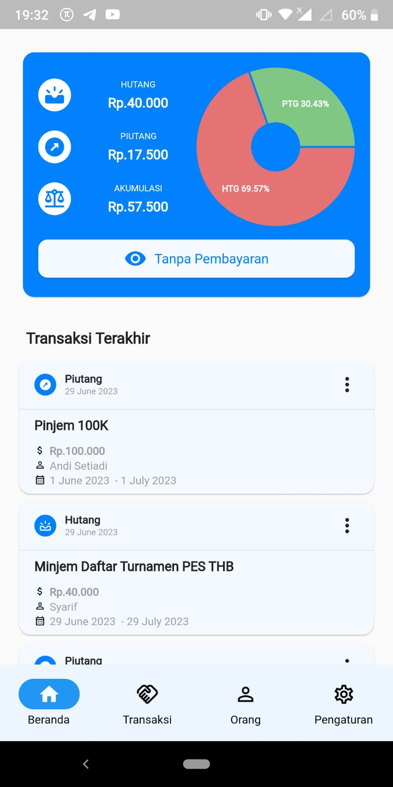
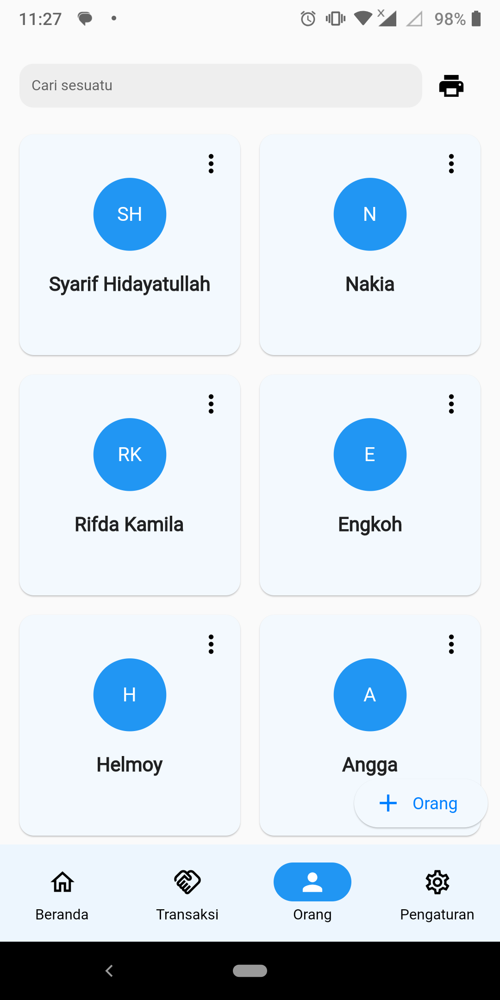
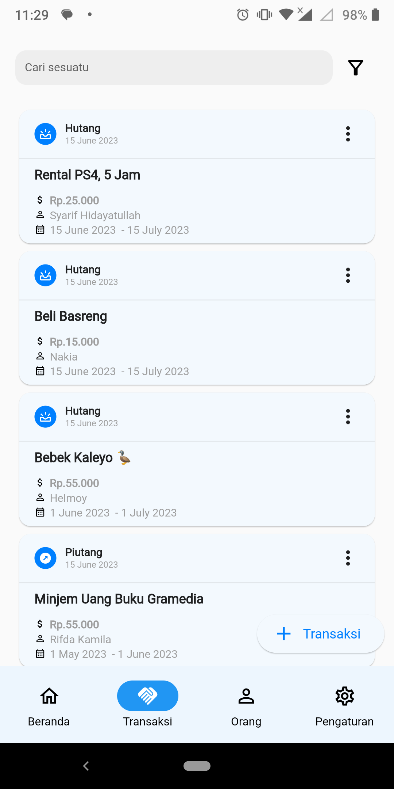
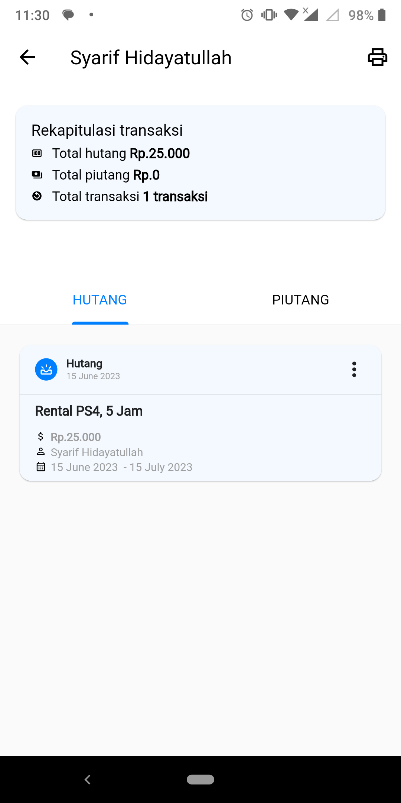
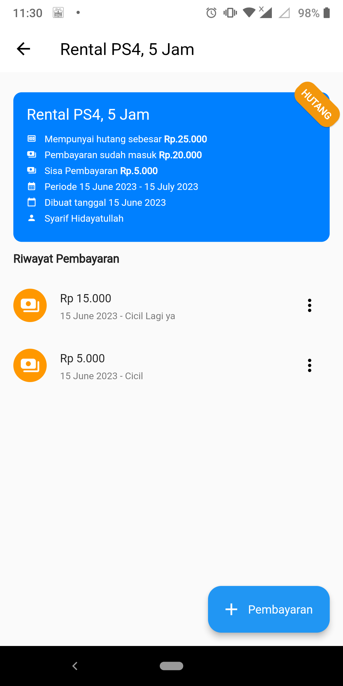
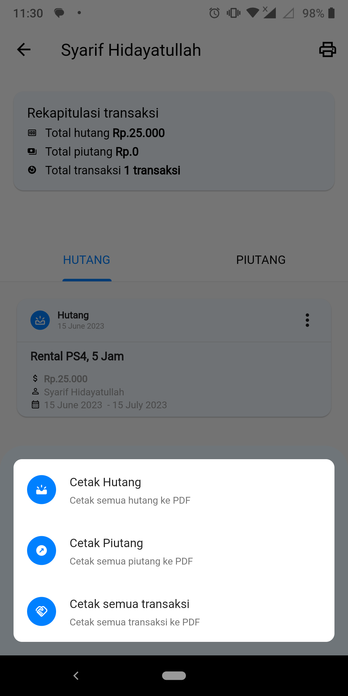
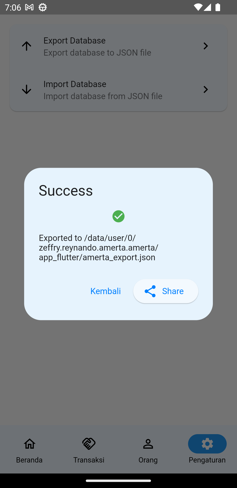
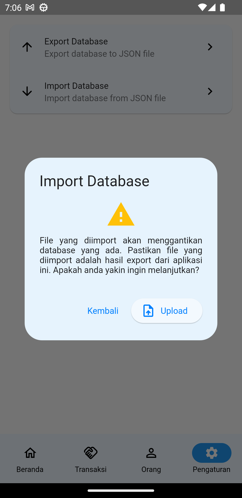

Aplikasi management Hutang & Piutang support report PDF

## Tech Stack

**Client:** Flutter

**Architecture** MVVM

**State Management** Riverpod

## Installation

1. `flutter clean && flutter pub get`
2. `dart run build_runner watch --delete-conflicting-outputs`
3. `flutter run`

## Feature

- [x] Management People (Read, Update, Delete, Add)
- [x] Management Transaction (Create, Update, Read)
- [x] Management Payment (Create, Update, Delete, Add)
- [x] Print Report PDF
      a. Based on people
      b. All transaction
      c. Specific Transaction

## Screenshot

### People List

<table>
    <tbody>
        <tr>
            <td align="center" style="font-weight:bold;">Home</td>
            <td align="center" style="font-weight:bold;">List People</td>
            <td align="center" style="font-weight:bold;">List Transaction</td>
        </tr>
        <tr>
            <td align="center">
                
            </td>
            <td align="center">
                
            </td>
            <td align="center">
                
            </td>
        </tr>
        <!-- New Row -->
        <tr>
            <td align="center" style="font-weight:bold;">Transaction People</td>
            <td align="center" style="font-weight:bold;">Detail Transaction</td>
            <td align="center" style="font-weight:bold;">Report PDF</td>
        </tr>
        <tr>
            <td align="center">
                
            </td>
            <td align="center">
                
            </td>
            <td align="center">
                
            </td>
        </tr>
         <!-- New Row -->
        <tr>
            <td align="center" style="font-weight:bold;">PDF Result</td>
            <td align="center" style="font-weight:bold;">Export JSON</td>
            <td align="center" style="font-weight:bold;">Import JSON</td>
        </tr>
        <tr>
            <td align="center">
                
            </td>
            <td align="center">
                
            </td>
            <td align="center">
                
            </td>
        </tr>
    </tbody>
</table>
